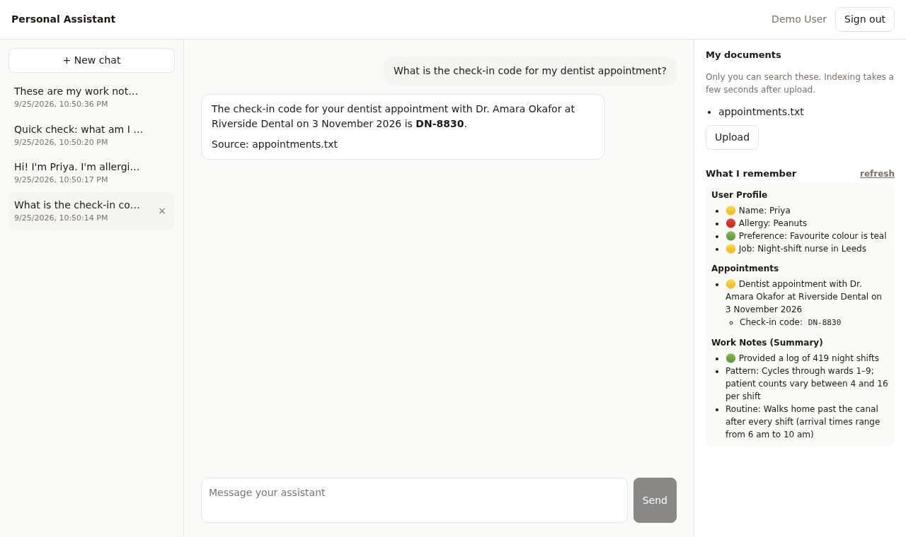
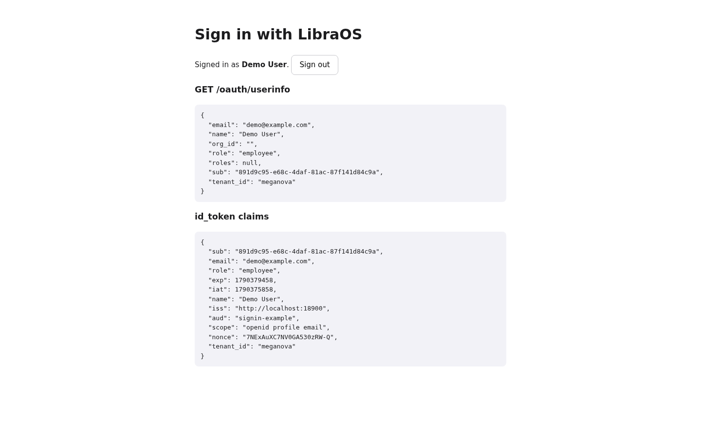

# Build a personal assistant app

In this tutorial you build a small but real AI app on LibraOS. People sign in
with their LibraOS account and get an assistant that:

- chats with them, using the app's **own agent**;
- keeps their **conversations**, so they can list and resume them;
- answers from **their documents**, which nobody else can search;
- **remembers** what they said, even in a brand-new conversation.



Everything here is runnable. The code lives in the
[`libraos/cookbook`](https://github.com/libraos/cookbook) repository:

| Folder | Step |
|---|---|
| [`get-started/`](https://github.com/libraos/cookbook/tree/main/get-started) | 1: a LibraOS kernel on your laptop |
| [`get-started/01-first-agent/`](https://github.com/libraos/cookbook/tree/main/get-started/01-first-agent) | 2: your first agent, from a script |
| [`get-started/02-sign-in-with-libraos/`](https://github.com/libraos/cookbook/tree/main/get-started/02-sign-in-with-libraos) | 3: "Sign in with LibraOS" |
| [`apps/personal-assistant/`](https://github.com/libraos/cookbook/tree/main/apps/personal-assistant) | 4–8: the assistant app |

```bash
git clone https://github.com/libraos/cookbook
cd cookbook
```

It takes about 30 minutes. At the end you'll understand the pieces every
LibraOS app is made of.

## Prerequisites

- Docker with Compose v2
- Node.js 20+
- A model endpoint, which can be either:
  - a hosted OpenAI-compatible gateway and its key, or
  - [Ollama](https://ollama.com) on your machine, for a fully local setup.

## How the pieces fit

```
browser ──► your app ──► LibraOS kernel
             │              ├─ sign-in (OpenID Connect)
             │              ├─ your app's agent
             │              ├─ conversations, documents, memory — per user
             │              └─ models
             └─ every call carries the signed-in user's own token
```

The app has **no backend of its own**. The browser signs the user in and
calls the kernel with *their* token, so the kernel scopes every answer to that
person: their conversations, their documents, their memory. The app never
runs as an admin.

## Step 1 — Run a kernel locally

```bash
cd get-started
cp .env.example .env
```

In `.env`, set:

- `LIBRA_OS_JWT_SECRET` to any long random string (`openssl rand -hex 32`);
- `LIBRA_OS_ADMIN_PASSWORD`;
- the secret after `quickstart:admin=` in `LIBRA_OS_SERVICE_CLIENTS`;
- one model block.

Then start the kernel:

```bash
docker compose up -d
curl http://localhost:8900/health     # {"service":"libraos","status":"ok"}
```

:::tip Three first-run gotchas, already handled in the compose file
- **`LIBRA_OS_PUBLIC_URL` is required.** Tokens name it as their issuer.
- **The container needs `ulimits: memlock: -1`.** The kernel refuses to start
  under Docker's default memory-lock limit.
- **The kernel uses three model tiers:** answer, brain and skill. Point
  `OPENAI_MODEL`, `LIBRA_OS_BRAIN_MODEL` and `LIBRA_OS_SKILL_MODEL` at a model
  your endpoint serves. If you don't, the startup log says
  `model preflight … FAILED` and chats hang.
:::

## Step 2 — Your first agent

```bash
./01-first-agent/first-agent.sh "Give me one tip for a productive morning."
```

The script does three things, and every LibraOS integration starts with them:

1. **Gets a token.** It exchanges the laptop-only `quickstart` client's
   secret: `POST /oauth/token` with `grant_type=client_credentials`.
2. **Creates an agent.** `POST /v1/agents` with
   `{"name":"first-assistant","agent_type":"persona","system":"…"}`.
3. **Chats.** `POST /agents/v1/first-assistant/chat` with `{"message":"…"}`,
   which returns `{response, conversation_id, model, …}`.

`first-agent.ts` holds a two-turn conversation. The chat route does **not**
replay history for you: send the whole conversation in `messages` every turn,
with the same `conversation_id`.

:::caution
`quickstart:admin` is a full-admin credential for your laptop. Real apps never
hold one. People sign in as themselves, which is the next step.
:::

## Step 3 — Sign in with LibraOS

Every LibraOS kernel is an OpenID Connect provider. Your app registers as a
client, and people sign in on the kernel's own page. Your app never sees a
password.



**Register the app** in the kernel's `.env` (one exact redirect URI per app;
PKCE is on by default). Then restart the kernel:

```bash
LIBRA_OS_OIDC_CLIENTS=signin-example=http://localhost:5173/callback,personal-assistant=http://localhost:5180/callback
```

**The flow** is in
[`02-sign-in-with-libraos/src/oidc.ts`](https://github.com/libraos/cookbook/blob/main/get-started/02-sign-in-with-libraos/src/oidc.ts),
about 60 lines with no library:

1. Redirect to `/oauth/authorize` with:
   - `client_id` and `redirect_uri`;
   - `response_type=code`;
   - `scope=openid profile email offline_access`;
   - `state`, `nonce`;
   - a PKCE `code_challenge` with `code_challenge_method=S256`.
2. On `/callback`, check `state`. Then `POST /oauth/token`, **form-encoded**,
   with `grant_type=authorization_code`, `code`, `client_id`, `redirect_uri`
   and your `code_verifier`.
3. Call the kernel with `Authorization: Bearer <access_token>`.
   `GET /oauth/userinfo` returns who the user is: `sub`, `email`, `name` and
   `roles`.
4. Renew with `grant_type=refresh_token` before the one-hour access token runs
   out. Refresh tokens **rotate**: each one works once.

Users are the kernel's. An admin of that kernel invites them, and one account
works in every app registered on it. What someone may do *inside* your app is
your app's decision, usually based on the kernel groups they belong to.

## Step 4 — Package your agent as an app

An *app* is a folder the kernel installs. Your agent ships with your code
rather than being created by hand:

```
apps/personal-assistant/libraos-app/
├── nova-app.yaml
└── agents/assistant.md
```

```yaml title="nova-app.yaml"
name: personal-assistant
version: 0.1.0
schema_prefix: pa_   # required even with no database migrations
agents: agents       # required: without it no agents load
```

```markdown title="agents/assistant.md"
---
name: assistant
description: A personal assistant that answers from the signed-in user's own documents and remembers what they tell it.
type: persona
knowledge_bindings: ["*"]   # search every collection the CALLER may read
---
You are a personal assistant for the signed-in user.
- Be concise and friendly. …
- Name documents by file name only, like this: "(from appointments.txt)". …
```

The frontmatter configures the agent and the body is its system prompt.
`knowledge_bindings: ["*"]` means "search whatever *the caller* may read".
For a normal user, that's only their own uploads.

Start the kernel with the app folder mounted (the cookbook's compose file
already does this), then install it and create a demo user:

```bash
apps/personal-assistant/scripts/setup.sh
# app: personal-assistant 0.1.0, 1 agent(s)
# user: created demo@example.com
```

`setup.sh` calls `POST /v1/apps/personal-assistant/install`, which is
admin-only and re-reads the agents. It then invites the demo user through
`POST /api/admin/users/invite`, and accepts the invitation with the password
you set in `PA_DEMO_PASSWORD`. Re-run it after you edit `assistant.md`.

Run the web app:

```bash
cd apps/personal-assistant/web
npm install
npm run dev     # http://localhost:5180 — sign in as demo@example.com
```

## Step 5 — Chat as the user

```ts title="web/src/api.ts"
const res = await authFetch(`/v1/apps/personal-assistant/agents/assistant/chat`, {
  method: "POST",
  headers: { "content-type": "application/json" },
  body: JSON.stringify({ messages, conversation_id: conversationId ?? undefined }),
});
// → { response, conversation_id, cited_sources, … }
```

- **`authFetch` adds the user's token,** and refreshes it once on a 401.
- **Send the whole conversation every turn.** `conversation_id` only says
  which thread to save the turn into.
- **Replies are Markdown.** The app renders them with `react-markdown`, which
  never injects raw HTML.

## Step 6 — Conversations

The kernel already stores every turn per user, so the app only needs to list
and reopen them:

| | Call |
|---|---|
| List | `GET /v1/conversations?agent=assistant` |
| Open | `GET /v1/conversations/:id` (includes `messages`) |
| Rename | `PATCH /v1/conversations/:id` with `{title}` |
| Delete | `DELETE /v1/conversations/:id` |

New conversations are untitled, so the app names each one after its first
question. To resume, load the stored messages and send them all with the next
question.

## Step 7 — Their documents

```ts
const form = new FormData();
form.append("file", file);
await authFetch("/api/documents/upload/my-documents", { method: "POST", body: form });
```

- **Uploads are private by construction.** For a normal user the kernel stores
  the file under their own folder and indexes it into a collection only they
  can read, whatever the request asks for. Ask the same question as another
  user and the assistant says it doesn't know.
- **Indexing is off by default.** The cookbook's compose file sets
  `LIBRA_OS_SUPERNOVA_ENABLED=true`. Without it, files are stored but never
  searchable.
- **The stock setup uses keyword search.** It has no vector database, so the
  kernel falls back to Postgres full-text search. Ask with words that appear
  in the document.

## Step 8 — Memory

Set `LIBRA_OS_OBSERVATIONAL_MEMORY=1` and the kernel remembers each user per
agent. The app does nothing special: a new conversation simply knows.


Once enough has been said, the kernel condenses it into notes. The app shows
them with `GET /v1/managed/memory?agent_id=assistant`, which returns only the
caller's own memory. Recall works before the notes appear.

## Taking it to production

- **Serve the app and the kernel from one origin,** behind one reverse proxy.
  The cookbook does this in development with Vite's proxy. It keeps sign-out's
  redirect back to your app working.
- **Register your production redirect URI,** and keep PKCE on.
- **Never ship an admin credential to the browser.** Everything the app does
  runs as the signed-in user.
- **Choose where the app runs:**
  - on the same kernel as your other apps, if they serve the same
    organisation;
  - on its own kernel, if it serves a different customer or audience. On one
    kernel, users, admins and connectors are shared.
- **Check permissions on every request.** For actions only some people may
  take, ask the kernel which groups the user belongs to
  (`GET /v1/managed/groups/mine`) and deny by default.

## What isn't there yet

These features were left out on purpose. The cookbook README has the details
for each.

- **Streaming replies.** The kernel can stream, but streamed turns aren't
  written to long-term memory yet, so the app waits for the full reply.
- **The user's own Gmail or calendar.** Connectors are organisation-wide today.
- **Acting on the user's behalf with their approval.** Only admins can approve
  actions that have side effects.
- **Scheduled tasks,** such as a daily briefing.
- **Removing a document from search.** Deleting the file doesn't remove its
  indexed text.

## Next steps

- [Creating an agent](/creating-an-agent): everything an agent definition can
  say.
- [Workspaces & memory](/workspaces-memory) and
  [Managing memory](/managing-memory): what persists, and for whom.
- [Knowledge & retrieval](/knowledge-retrieval): vector backends, for
  better-than-keyword search.
- [Customer support agent](/guides/customer-support): a production guide with
  tools, escalation and evaluation.
